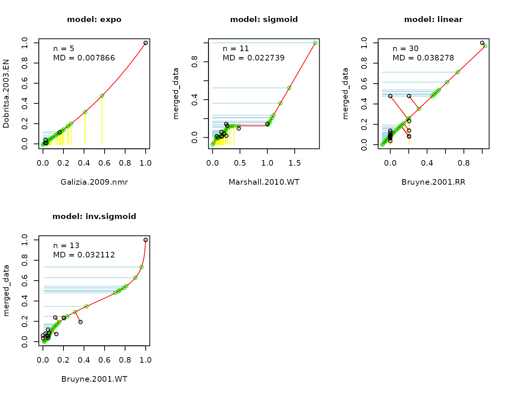
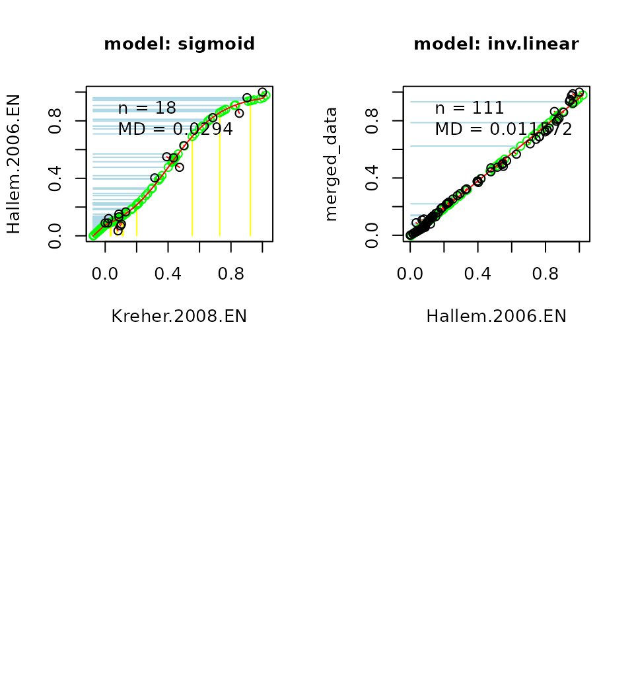

# The Database of Odor Responses - DoOR functions package

DoOR consists of two R packages and both are needed for DoOR to work
properly. One package, `DoOR.data` contains all the *Drosophila* odor
responses we gathered from labs around the world or recorded ourselves.
The other package `DoOR.functions` contains the DoOR framework for
integrating heterogeneous data sets as well as analysis tools and
functions for visualization.

In this vignette we describe how to build, modify and update DoOR and
introduce some helper functions. There are two other vignettes
explaining the [plotting
functions](https://docs.ropensci.org/DoOR.functions/articles/DoOR_visualizations.md)
and the [analysis
tools](https://docs.ropensci.org/DoOR.functions/articles/DoOR_tools.md)
in detail. \##

### Content

- [loading DoOR](#loading)
- [Modifying, building and updating DoOR](#building)
  - [Importing new data with `import_new_data()`](#import_new_data)
  - [Building the complete data base with
    `create_door_database()`](#create_door_database)
  - [Updating parts of the data base with
    `update_door_database()`](#update_door_database)
  - [`model_response()` and `model_response_seq()`](#model)
  - [Removing a study with `remove_study()`](#remove_study)
  - [Updating the odor information with
    `update_door_odorinfo()`](#update_door_odorinfo)
- [Helper functions](#helper)

### Loading DoOR

The first step after starting R is to attach both packages and to load
the response data:

``` r

library(DoOR.data)
```

    ## 
    ## Welcome to DoOR.data
    ## Version: 2.0.1.9001
    ## Released: 2026-07-17
    ## 
    ## Please use load_door_data() to load all data into your workspace 
    ##       now.

``` r

library(DoOR.functions)
```

    ## 
    ## Welcome to DoOR.functions
    ## Version: 2.0.3.9000
    ## Released: 2026-07-10

``` r

load_door_data(nointeraction = TRUE)
```

[`load_door_data()`](https://docs.ropensci.org/DoOR.data/reference/load_door_data.html)
attaches the data from `DoOR.data`.

## Modifying, building and updating DoOR

DoOR comes with all the original data sets as well as with a
pre-computed version of the consensus matrix `door_response_matrix`
where all data was integrated using the DoOR merging algorithms (see
paper for details on how the algorithm works). The values in
`door_response_matrix` are globally normalized with values scaled
`[0,1]`. `door_response_matrix_non_normalized` is a version of the
consensus data that is not globally normalized meaning that responses
are scaled `[0,1]` within each *responding unit* (receptor, sensory
neuron, glomerulus…).

### Importing new data with `import_new_data()`

It is easy to add new response data to DoOR, we only have to take care
to provide it in the right format:

- either a .csv or a .txt file with fields separated by colons or tabs
  (see [`?read.table`](https://rdrr.io/r/utils/read.table.html) for
  detailed specifications). \* the filename corresponds to the later
  name of the data set \* if we add e.g. recordings obtained with
  different methods, these should go into two data sets and thus into
  two different files that we import \* e.g. “Hallem.2004.EN” and
  “Hallem.2004.WT” are the “empty neuron” and the “wildtype neuron”
  recordings from Elissa Hallem’s 2004 publication \* the file needs at
  least two columns: 1. one column named “InChIKey” holding the InChIKey
  of the odorant 1. one column named after the responding unit the
  recording comes from (e.g. “Or22a”)

A minimal example file could look like this:

|     | InChIKey                    | Or22a |
|:----|:----------------------------|------:|
| 1   | SFR                         |     4 |
| 3   | VHUUQVKOLVNVRT-UHFFFAOYSA-N |    17 |
| 4   | KIDHWZJUCRJVML-UHFFFAOYSA-N |    16 |
| 5   | VHRGRCVQAFMJIZ-UHFFFAOYSA-N |    17 |

We can provide more chemical identifiers:

|     | Class | Name               | InChIKey                    | CID   | CAS       | Or22a |
|:----|:------|:-------------------|:----------------------------|:------|:----------|------:|
| 1   | NA    | sfr                | SFR                         | SFR   | SFR       |     4 |
| 3   | amine | ammonium hydroxide | VHUUQVKOLVNVRT-UHFFFAOYSA-N | 14923 | 1336-21-6 |    17 |
| 4   | amine | putrescine         | KIDHWZJUCRJVML-UHFFFAOYSA-N | 1045  | 110-60-1  |    16 |
| 5   | amine | cadaverine         | VHRGRCVQAFMJIZ-UHFFFAOYSA-N | 273   | 462-94-2  |    17 |

Any of the following will be imported:

**`Class`**
:   e.g. “ester”
:   the chemical class an odorant belongs to

**`Name`**
:   e.g. “isopentyl acetate”

**`InChIKey`**
:   e.g. “MLFHJEHSLIIPHL-UHFFFAOYSA-N”
    ([details](https://en.wikipedia.org/wiki/International_Chemical_Identifier))

**`InChI`**
:   e.g. “InChI=1S/C7H14O2/c1-6(2)4-5-9-7(3)8/h6H,4-5H2,1-3H3”
    ([details](https://en.wikipedia.org/wiki/International_Chemical_Identifier))

**`CAS`**
:   e.g. “123-92-2”
    ([details](https://en.wikipedia.org/wiki/CAS_Registry_Number))

**`CID`**
:   e.g. “31276” ([details](https://en.wikipedia.org/wiki/PubChem))

**`SMILES`**
:   e.g. “C(C(C)C)COC(=O)C”
    ([details](https://en.wikipedia.org/wiki/Simplified_molecular-input_line-entry_system))

See
[`?import_new_data`](https://docs.ropensci.org/DoOR.functions/reference/import_new_data.md)
for more details. We can e.g. import data also based on CAS or CID
instead of InChIKey.

##### Looking up InChIKeys If you do not know the InChIKeys of the odorants in

your data set, we recommend using the
[`webchem`](https://cran.r-project.org/package=webchem) package for
automated lookup or doing it manually *via*
<http://cactus.nci.nih.gov/chemical/structure> or any other chemical
lookup service.

### Building the complete data base with

[`create_door_database()`](https://docs.ropensci.org/DoOR.functions/reference/create_door_database.md)
Once we imported new data we can use
[`create_door_database()`](https://docs.ropensci.org/DoOR.functions/reference/create_door_database.md)
in order to rebuild both response matrices. During the merge process
some data sets might be excluded because either their overlap with other
studies is too low or the fit against other studies is too bad; these
studies will be recorded in `door_excluded_data`.

### Updating parts of the data base with

[`update_door_database()`](https://docs.ropensci.org/DoOR.functions/reference/update_door_database.md)
If we imported new data only for a few receptors, we can update the data
base with
[`update_door_database()`](https://docs.ropensci.org/DoOR.functions/reference/update_door_database.md).
There are two ways to update the data base:

#### Using the heuristic approach This is the faster way to perform a merge of

all data sets. All possible binary combinations of data sets will be
merged using 10 different fitting functions on the odorants that were
measured in both data sets. The two data sets yielding the “best merge”
(i.e. lowest mean deviations of points from the fitted function) will be
merged. The process of pairwise merges will be repeated with the
“merged_data” against the remaining data sets until all of them are
included:

``` r

update_door_database("Or92a", permutation = FALSE, plot = TRUE)
```

    ## Not all datasets could be merged because they did not reach the
    ##                  criterion.

    ## door_response_matrix_non_normalized has been updated for Or92a

    ## door_response_matrix has been updated for Or92a

    ## door_excluded_data has been updated for Or92a



#### Trying all permutations The more exhaustive way to update the data base is

to test all possible sequences of data set merges, calculating the mean
deviations from all original data sets and selecting the merge that
produces the lowest mean deviations. This approach works well for
responding units that contain a low number of recorded data sets. For
responding units containing 5 data sets we have to calculate merges for
120 different sequences. With 6 it is already 720 sequences and with 10
data sets we have to test \> 3.6 million different sequences.

While this can be done *via* parallel computing, this is nothing you
should try on your home PC. For the pre-computed response matrices we
performed matches using the permutation approach for all responding
units that contained a maximum of 10 different data sets on a computing
cluster. For DoOR 2.0 these are all responding units except Or22a.

``` r

update_door_database("Or67a", permutation = TRUE, plot = FALSE)
```

    ## All possible permutations (6) have been calculated, now merging.

    ## Warning in getInitial.selfStart(func, data, mCall = as.list(match.call(func, :
    ## selfStart initializing functions should have a final '...' argument since R
    ## 4.1.0
    ## Warning in getInitial.selfStart(func, data, mCall = as.list(match.call(func, :
    ## selfStart initializing functions should have a final '...' argument since R
    ## 4.1.0
    ## Warning in getInitial.selfStart(func, data, mCall = as.list(match.call(func, :
    ## selfStart initializing functions should have a final '...' argument since R
    ## 4.1.0
    ## Warning in getInitial.selfStart(func, data, mCall = as.list(match.call(func, :
    ## selfStart initializing functions should have a final '...' argument since R
    ## 4.1.0
    ## Warning in getInitial.selfStart(func, data, mCall = as.list(match.call(func, :
    ## selfStart initializing functions should have a final '...' argument since R
    ## 4.1.0
    ## Warning in getInitial.selfStart(func, data, mCall = as.list(match.call(func, :
    ## selfStart initializing functions should have a final '...' argument since R
    ## 4.1.0
    ## Warning in getInitial.selfStart(func, data, mCall = as.list(match.call(func, :
    ## selfStart initializing functions should have a final '...' argument since R
    ## 4.1.0
    ## Warning in getInitial.selfStart(func, data, mCall = as.list(match.call(func, :
    ## selfStart initializing functions should have a final '...' argument since R
    ## 4.1.0
    ## Warning in getInitial.selfStart(func, data, mCall = as.list(match.call(func, :
    ## selfStart initializing functions should have a final '...' argument since R
    ## 4.1.0
    ## Warning in getInitial.selfStart(func, data, mCall = as.list(match.call(func, :
    ## selfStart initializing functions should have a final '...' argument since R
    ## 4.1.0

    ## [1/6] Hallem.2006.EN, Gabler.2013.AL, Hallem.2004.EN ------ Mean distance: 0.0282

    ## Warning in getInitial.selfStart(func, data, mCall = as.list(match.call(func, :
    ## selfStart initializing functions should have a final '...' argument since R
    ## 4.1.0
    ## Warning in getInitial.selfStart(func, data, mCall = as.list(match.call(func, :
    ## selfStart initializing functions should have a final '...' argument since R
    ## 4.1.0
    ## Warning in getInitial.selfStart(func, data, mCall = as.list(match.call(func, :
    ## selfStart initializing functions should have a final '...' argument since R
    ## 4.1.0
    ## Warning in getInitial.selfStart(func, data, mCall = as.list(match.call(func, :
    ## selfStart initializing functions should have a final '...' argument since R
    ## 4.1.0
    ## Warning in getInitial.selfStart(func, data, mCall = as.list(match.call(func, :
    ## selfStart initializing functions should have a final '...' argument since R
    ## 4.1.0
    ## Warning in getInitial.selfStart(func, data, mCall = as.list(match.call(func, :
    ## selfStart initializing functions should have a final '...' argument since R
    ## 4.1.0
    ## Warning in getInitial.selfStart(func, data, mCall = as.list(match.call(func, :
    ## selfStart initializing functions should have a final '...' argument since R
    ## 4.1.0
    ## Warning in getInitial.selfStart(func, data, mCall = as.list(match.call(func, :
    ## selfStart initializing functions should have a final '...' argument since R
    ## 4.1.0
    ## Warning in getInitial.selfStart(func, data, mCall = as.list(match.call(func, :
    ## selfStart initializing functions should have a final '...' argument since R
    ## 4.1.0
    ## Warning in getInitial.selfStart(func, data, mCall = as.list(match.call(func, :
    ## selfStart initializing functions should have a final '...' argument since R
    ## 4.1.0

    ## [2/6] Hallem.2006.EN, Hallem.2004.EN, Gabler.2013.AL ------ Mean distance: 0.0251

    ## Warning in getInitial.selfStart(func, data, mCall = as.list(match.call(func, :
    ## selfStart initializing functions should have a final '...' argument since R
    ## 4.1.0
    ## Warning in getInitial.selfStart(func, data, mCall = as.list(match.call(func, :
    ## selfStart initializing functions should have a final '...' argument since R
    ## 4.1.0
    ## Warning in getInitial.selfStart(func, data, mCall = as.list(match.call(func, :
    ## selfStart initializing functions should have a final '...' argument since R
    ## 4.1.0
    ## Warning in getInitial.selfStart(func, data, mCall = as.list(match.call(func, :
    ## selfStart initializing functions should have a final '...' argument since R
    ## 4.1.0
    ## Warning in getInitial.selfStart(func, data, mCall = as.list(match.call(func, :
    ## selfStart initializing functions should have a final '...' argument since R
    ## 4.1.0
    ## Warning in getInitial.selfStart(func, data, mCall = as.list(match.call(func, :
    ## selfStart initializing functions should have a final '...' argument since R
    ## 4.1.0
    ## Warning in getInitial.selfStart(func, data, mCall = as.list(match.call(func, :
    ## selfStart initializing functions should have a final '...' argument since R
    ## 4.1.0
    ## Warning in getInitial.selfStart(func, data, mCall = as.list(match.call(func, :
    ## selfStart initializing functions should have a final '...' argument since R
    ## 4.1.0
    ## Warning in getInitial.selfStart(func, data, mCall = as.list(match.call(func, :
    ## selfStart initializing functions should have a final '...' argument since R
    ## 4.1.0
    ## Warning in getInitial.selfStart(func, data, mCall = as.list(match.call(func, :
    ## selfStart initializing functions should have a final '...' argument since R
    ## 4.1.0

    ## [3/6] Gabler.2013.AL, Hallem.2006.EN, Hallem.2004.EN ------ Mean distance: 0.0282

    ## Warning in getInitial.selfStart(func, data, mCall = as.list(match.call(func, :
    ## selfStart initializing functions should have a final '...' argument since R
    ## 4.1.0
    ## Warning in getInitial.selfStart(func, data, mCall = as.list(match.call(func, :
    ## selfStart initializing functions should have a final '...' argument since R
    ## 4.1.0
    ## Warning in getInitial.selfStart(func, data, mCall = as.list(match.call(func, :
    ## selfStart initializing functions should have a final '...' argument since R
    ## 4.1.0
    ## Warning in getInitial.selfStart(func, data, mCall = as.list(match.call(func, :
    ## selfStart initializing functions should have a final '...' argument since R
    ## 4.1.0
    ## Warning in getInitial.selfStart(func, data, mCall = as.list(match.call(func, :
    ## selfStart initializing functions should have a final '...' argument since R
    ## 4.1.0
    ## Warning in getInitial.selfStart(func, data, mCall = as.list(match.call(func, :
    ## selfStart initializing functions should have a final '...' argument since R
    ## 4.1.0
    ## Warning in getInitial.selfStart(func, data, mCall = as.list(match.call(func, :
    ## selfStart initializing functions should have a final '...' argument since R
    ## 4.1.0
    ## Warning in getInitial.selfStart(func, data, mCall = as.list(match.call(func, :
    ## selfStart initializing functions should have a final '...' argument since R
    ## 4.1.0
    ## Warning in getInitial.selfStart(func, data, mCall = as.list(match.call(func, :
    ## selfStart initializing functions should have a final '...' argument since R
    ## 4.1.0
    ## Warning in getInitial.selfStart(func, data, mCall = as.list(match.call(func, :
    ## selfStart initializing functions should have a final '...' argument since R
    ## 4.1.0

    ## [4/6] Gabler.2013.AL, Hallem.2004.EN, Hallem.2006.EN ------ Mean distance: 0.0288

    ## Warning in getInitial.selfStart(func, data, mCall = as.list(match.call(func, :
    ## selfStart initializing functions should have a final '...' argument since R
    ## 4.1.0
    ## Warning in getInitial.selfStart(func, data, mCall = as.list(match.call(func, :
    ## selfStart initializing functions should have a final '...' argument since R
    ## 4.1.0
    ## Warning in getInitial.selfStart(func, data, mCall = as.list(match.call(func, :
    ## selfStart initializing functions should have a final '...' argument since R
    ## 4.1.0
    ## Warning in getInitial.selfStart(func, data, mCall = as.list(match.call(func, :
    ## selfStart initializing functions should have a final '...' argument since R
    ## 4.1.0
    ## Warning in getInitial.selfStart(func, data, mCall = as.list(match.call(func, :
    ## selfStart initializing functions should have a final '...' argument since R
    ## 4.1.0
    ## Warning in getInitial.selfStart(func, data, mCall = as.list(match.call(func, :
    ## selfStart initializing functions should have a final '...' argument since R
    ## 4.1.0
    ## Warning in getInitial.selfStart(func, data, mCall = as.list(match.call(func, :
    ## selfStart initializing functions should have a final '...' argument since R
    ## 4.1.0
    ## Warning in getInitial.selfStart(func, data, mCall = as.list(match.call(func, :
    ## selfStart initializing functions should have a final '...' argument since R
    ## 4.1.0
    ## Warning in getInitial.selfStart(func, data, mCall = as.list(match.call(func, :
    ## selfStart initializing functions should have a final '...' argument since R
    ## 4.1.0
    ## Warning in getInitial.selfStart(func, data, mCall = as.list(match.call(func, :
    ## selfStart initializing functions should have a final '...' argument since R
    ## 4.1.0

    ## [5/6] Hallem.2004.EN, Hallem.2006.EN, Gabler.2013.AL ------ Mean distance: 0.025

    ## Warning in getInitial.selfStart(func, data, mCall = as.list(match.call(func, :
    ## selfStart initializing functions should have a final '...' argument since R
    ## 4.1.0
    ## Warning in getInitial.selfStart(func, data, mCall = as.list(match.call(func, :
    ## selfStart initializing functions should have a final '...' argument since R
    ## 4.1.0
    ## Warning in getInitial.selfStart(func, data, mCall = as.list(match.call(func, :
    ## selfStart initializing functions should have a final '...' argument since R
    ## 4.1.0
    ## Warning in getInitial.selfStart(func, data, mCall = as.list(match.call(func, :
    ## selfStart initializing functions should have a final '...' argument since R
    ## 4.1.0
    ## Warning in getInitial.selfStart(func, data, mCall = as.list(match.call(func, :
    ## selfStart initializing functions should have a final '...' argument since R
    ## 4.1.0
    ## Warning in getInitial.selfStart(func, data, mCall = as.list(match.call(func, :
    ## selfStart initializing functions should have a final '...' argument since R
    ## 4.1.0
    ## Warning in getInitial.selfStart(func, data, mCall = as.list(match.call(func, :
    ## selfStart initializing functions should have a final '...' argument since R
    ## 4.1.0
    ## Warning in getInitial.selfStart(func, data, mCall = as.list(match.call(func, :
    ## selfStart initializing functions should have a final '...' argument since R
    ## 4.1.0
    ## Warning in getInitial.selfStart(func, data, mCall = as.list(match.call(func, :
    ## selfStart initializing functions should have a final '...' argument since R
    ## 4.1.0
    ## Warning in getInitial.selfStart(func, data, mCall = as.list(match.call(func, :
    ## selfStart initializing functions should have a final '...' argument since R
    ## 4.1.0

    ## [6/6] Hallem.2004.EN, Gabler.2013.AL, Hallem.2006.EN ------ Mean distance: 0.0287

    ## --------------------------------------------------------

    ## The optimized sequence with the lowest mean MD 0.025 is:

    ## Hallem.2004.EN -> Hallem.2006.EN -> Gabler.2013.AL

    ## Warning in getInitial.selfStart(func, data, mCall = as.list(match.call(func, :
    ## selfStart initializing functions should have a final '...' argument since R
    ## 4.1.0
    ## Warning in getInitial.selfStart(func, data, mCall = as.list(match.call(func, :
    ## selfStart initializing functions should have a final '...' argument since R
    ## 4.1.0
    ## Warning in getInitial.selfStart(func, data, mCall = as.list(match.call(func, :
    ## selfStart initializing functions should have a final '...' argument since R
    ## 4.1.0
    ## Warning in getInitial.selfStart(func, data, mCall = as.list(match.call(func, :
    ## selfStart initializing functions should have a final '...' argument since R
    ## 4.1.0

    ## door_response_matrix_non_normalized has been updated for Or67a

    ## door_response_matrix has been updated for Or67a

    ## door_excluded_data has been updated for Or67a

### `model_response()` and `model_response_seq()`

[`update_door_database()`](https://docs.ropensci.org/DoOR.functions/reference/update_door_database.md)
and `createDatabse()` call
[`model_response()`](https://docs.ropensci.org/DoOR.functions/reference/model_response.md)
and
[`model_response_seq()`](https://docs.ropensci.org/DoOR.functions/reference/model_response_seq.md)
to perform the merges and update the different DoOR objects. If we only
want to perform a merge we can call them both directly.

#### Merging using the heuristic with `model_response()` `model_response()`

returns a list containing the merged data, the names of the excluded
data sets (if any) and the names of the included data sets (if any were
excluded).

``` r

merge <- model_response(Or67a, plot = FALSE)
knitr::kable(head(merge$model.response))
```

| Class | Name | InChIKey | CID | CAS | merged_data |
|:---|:---|:---|:---|:---|---:|
| NA | sfr | SFR | SFR | SFR | 0.0401343 |
| other | water | XLYOFNOQVPJJNP-UHFFFAOYSA-N | 962 | 7732-18-5 | NA |
| amine | ammonium hydroxide | VHUUQVKOLVNVRT-UHFFFAOYSA-N | 14923 | 1336-21-6 | 0.0640151 |
| amine | putrescine | KIDHWZJUCRJVML-UHFFFAOYSA-N | 1045 | 110-60-1 | 0.0220159 |
| amine | cadaverine | VHRGRCVQAFMJIZ-UHFFFAOYSA-N | 273 | 462-94-2 | 0.0141344 |
| amine | ammonia | QGZKDVFQNNGYKY-UHFFFAOYSA-N | 222 | 7664-41-7 | NA |

#### Merging in a specific sequence with `model_response_seq()`

[`update_door_database()`](https://docs.ropensci.org/DoOR.functions/reference/update_door_database.md)
with `permutation = TRUE` calls
[`model_response_seq()`](https://docs.ropensci.org/DoOR.functions/reference/model_response_seq.md).
Like
[`model_response()`](https://docs.ropensci.org/DoOR.functions/reference/model_response.md)
we can also call model_response_seq directly:

``` r

SEQ <- c("Hallem.2006.EN","Kreher.2008.EN","Hallem.2006.EN")
merge <- model_response_seq(Or35a, SEQ = SEQ, plot = TRUE)
```

    ## Warning in getInitial.selfStart(func, data, mCall = as.list(match.call(func, :
    ## selfStart initializing functions should have a final '...' argument since R
    ## 4.1.0
    ## Warning in getInitial.selfStart(func, data, mCall = as.list(match.call(func, :
    ## selfStart initializing functions should have a final '...' argument since R
    ## 4.1.0
    ## Warning in getInitial.selfStart(func, data, mCall = as.list(match.call(func, :
    ## selfStart initializing functions should have a final '...' argument since R
    ## 4.1.0
    ## Warning in getInitial.selfStart(func, data, mCall = as.list(match.call(func, :
    ## selfStart initializing functions should have a final '...' argument since R
    ## 4.1.0

``` r

head(merge)
```

    ## [1] 0.09675994         NA 0.09047548 0.07062655 0.12658721         NA



### Removing a study with `remove_study()` `remove_study()` will

remove a data set from all DoOR data objects. If we import a data set
that already exists with
[`import_new_data()`](https://docs.ropensci.org/DoOR.functions/reference/import_new_data.md),
[`remove_study()`](https://docs.ropensci.org/DoOR.functions/reference/remove_study.md)
will automatically run before the data is imported.

``` r

remove_study(study = "Hallem.2004.EN")
```

    ## removed Hallem.2004.EN from Or2a .

    ## removed Hallem.2004.EN from Or7a .

    ## removed Hallem.2004.EN from Or9a .

    ## removed Hallem.2004.EN from Or10a .

    ## removed Hallem.2004.EN from Or19a .

    ## removed Hallem.2004.EN from Or22a .

    ## removed Hallem.2004.EN from Or23a .

    ## removed Hallem.2004.EN from Or33b .

    ## removed Hallem.2004.EN from Or35a .

    ## removed Hallem.2004.EN from Or43a .

    ## removed Hallem.2004.EN from Or43b .

    ## removed Hallem.2004.EN from Or47a .

    ## removed Hallem.2004.EN from Or47b .

    ## removed Hallem.2004.EN from Or49b .

    ## removed Hallem.2004.EN from Or59b .

    ## removed Hallem.2004.EN from Or65a .

    ## removed Hallem.2004.EN from Or67a .

    ## removed Hallem.2004.EN from Or67c .

    ## removed Hallem.2004.EN from Or82a .

    ## removed Hallem.2004.EN from Or85a .

    ## removed Hallem.2004.EN from Or85b .

    ## removed Hallem.2004.EN from Or85f .

    ## removed Hallem.2004.EN from Or88a .

    ## removed Hallem.2004.EN from Or98a .

    ## removed Hallem.2004.EN from 'door_response_range'

    ## removed Hallem.2004.EN from 'door_global_normalization_weights'

### Updating the odor information with

[`update_door_odorinfo()`](https://docs.ropensci.org/DoOR.functions/reference/update_door_odorinfo.md)
If we edit the general odor information in
[`DoOR.data::odor`](https://docs.ropensci.org/DoOR.data/reference/odor.html)
we need to update all other DoOR objects with the new information.
[`update_door_odorinfo()`](https://docs.ropensci.org/DoOR.functions/reference/update_door_odorinfo.md)
overwrites the first 5 columns of the DoOR responding units data frames
(e.g. `Or22a`), it does not add or remove lines!

## Helper functions

There are several small helper functions that belong to
`DoOR.functions`.

### `trans_id()`

Maybe **the** most important little function in DoOR. With
[`trans_id()`](https://docs.ropensci.org/DoOR.functions/reference/trans_id.md)
we can translate odorant identifiers, e.g. from CAS numbers to InChIKeys
or to names. The information is taken from
[`DoOR.data::odor`](https://docs.ropensci.org/DoOR.data/reference/odor.html),
any `colnames(odor)` can be used to define input or output:

``` r

trans_id("123-92-2")
```

    ## [1] "MLFHJEHSLIIPHL-UHFFFAOYSA-N"

``` r

trans_id("123-92-2", to = "Name")
```

    ## [1] "isopentyl acetate"

``` r

trans_id("carbon dioxide", from = "Name", to = "SMILES")
```

    ## [1] "O=C=O"

``` r

odorants <- c("carbon dioxide", "pentanoic acid", "water", "benzaldehyde", 
              "isopentyl acetate")
trans_id(odorants, from = "Name", to = "InChI")
```

    ## [1] "InChI=1S/CO2/c2-1-3"                                
    ## [2] "InChI=1S/C5H10O2/c1-2-3-4-5(6)7/h2-4H2,1H3,(H,6,7)" 
    ## [3] "InChI=1S/H2O/h1H2"                                  
    ## [4] "InChI=1S/C7H6O/c8-6-7-4-2-1-3-5-7/h1-6H"            
    ## [5] "InChI=1S/C7H14O2/c1-6(2)4-5-9-7(3)8/h6H,4-5H2,1-3H3"

### `reset_sfr()` `reset_sfr()` subtracts the values of a specified

odorant from a response vector or from the whole response matrix. It is
usually used to subtract the spontaneous firing rate of an odorant, thus
setting it to zero and restoring inhibitory responses. We treat SFR like
a normal odorant during the merging process, thus it becomes \> 0 if
negative values exist (as all data gets rescaled `[0,1]` before
merging).

[`reset_sfr()`](https://docs.ropensci.org/DoOR.functions/reference/reset_sfr.md)
works either on the whole `door_response_matrix`, then an odorant
InChIKey has to be specified for subtraction. Or it subtracts a value
from a response vector.

``` r

rm_sfrReset <- reset_sfr(x = door_response_matrix, sfr = "SFR")
knitr::kable(rm_sfrReset[1:10,6:15], digits = 2)
```

|  | ac3B | ac4 | Or1a | Or2a | Or7a | Or9a | Or10a | Or13a | Or19a | Or22a |
|:---|---:|---:|---:|---:|---:|---:|---:|---:|---:|---:|
| SFR | 0.00 | 0.00 | 0.00 | 0.00 | 0.00 | 0.00 | 0.00 | 0.00 | 0.00 | 0.00 |
| XLYOFNOQVPJJNP-UHFFFAOYSA-N | 0.02 | 0.01 | 0.02 | NA | 0.07 | 0.00 | 0.01 | 0.12 | NA | 0.28 |
| VHUUQVKOLVNVRT-UHFFFAOYSA-N | 0.33 | 0.06 | NA | 0.01 | 0.04 | 0.04 | 0.00 | 0.04 | 0.00 | 0.10 |
| KIDHWZJUCRJVML-UHFFFAOYSA-N | 0.37 | 0.00 | NA | 0.02 | 0.03 | 0.03 | 0.01 | 0.07 | -0.02 | 0.09 |
| VHRGRCVQAFMJIZ-UHFFFAOYSA-N | 0.02 | -0.01 | NA | 0.00 | -0.01 | 0.08 | -0.01 | NA | -0.01 | 0.01 |
| QGZKDVFQNNGYKY-UHFFFAOYSA-N | 0.06 | 0.08 | NA | NA | 0.06 | NA | 0.05 | 0.04 | NA | 0.00 |
| HZAXFHJVJLSVMW-UHFFFAOYSA-N | NA | 0.01 | NA | NA | 0.06 | NA | 0.02 | 0.05 | NA | 0.20 |
| WJYIASZWHGOTOU-UHFFFAOYSA-N | 0.41 | 0.00 | NA | NA | NA | NA | NA | NA | -0.06 | NA |
| BMFVGAAISNGQNM-UHFFFAOYSA-N | 0.32 | -0.01 | NA | NA | NA | NA | NA | NA | NA | NA |
| ROSDSFDQCJNGOL-UHFFFAOYSA-N | 0.19 | 0.09 | NA | NA | NA | NA | NA | NA | NA | NA |

``` r

reset_sfr(x = c(1:10), sfr = 4)
```

    ##  [1] -3 -2 -1  0  1  2  3  4  5  6

### `door_default_values()` `door_default_values()` returns

default values for several parameters used by the DoOR functions,
e.g. the default odor identifier of the colors used in plots.

``` r

door_default_values("ident")
```

    ## [1] "InChIKey"

``` r

door_default_values("colors")
```

    ## [1] "#0570b0" "#74a9cf" "#ffffff" "#fdcc8a" "#fc8d59" "#d7301f"

### `get_responses()` `get_responses()` returns the response

values of one or several odorants across individual data sets.

``` r

odorants  <- trans_id(c("carbon dioxide", "isopentyl acetate"), from = "Name")
responses <- get_responses(odorants)
responses <- na.omit(responses)
knitr::kable(head(responses))
```

|     | ORs  | studies          | Odor                        | Response |
|:----|:-----|:-----------------|:----------------------------|---------:|
| 25  | ac3B | Marshall.2010.WT | CURLTUGMZLYLDI-UHFFFAOYSA-N |       13 |
| 29  | ac4  | Marshall.2010.WT | CURLTUGMZLYLDI-UHFFFAOYSA-N |       -1 |
| 30  | ac4  | Yao.2005.WT      | MLFHJEHSLIIPHL-UHFFFAOYSA-N |        1 |
| 33  | Or1a | Kreher.2008.EN   | CURLTUGMZLYLDI-UHFFFAOYSA-N |        4 |
| 34  | Or1a | Kreher.2008.EN   | MLFHJEHSLIIPHL-UHFFFAOYSA-N |       21 |
| 36  | Or2a | Kreher.2008.EN   | MLFHJEHSLIIPHL-UHFFFAOYSA-N |       73 |

### `get_normalized_responses()`

[`get_normalized_responses()`](https://docs.ropensci.org/DoOR.functions/reference/get_normalized_responses.md)
gathers responses to the specified odorants from the
door_response_matrix and resets the SFR *via*
[`reset_sfr()`](https://docs.ropensci.org/DoOR.functions/reference/reset_sfr.md):

``` r

odorants  <- trans_id(c("carbon dioxide", "isopentyl acetate"), from = "Name")
responses <- get_normalized_responses(odorants)
responses <- na.omit(responses)
knitr::kable(head(responses))
```

|     | ORs  | Odor                        | Response |
|:----|:-----|:----------------------------|---------:|
| 11  | ac3B | CURLTUGMZLYLDI-UHFFFAOYSA-N |   -0.043 |
| 13  | ac4  | CURLTUGMZLYLDI-UHFFFAOYSA-N |   -0.001 |
| 14  | ac4  | MLFHJEHSLIIPHL-UHFFFAOYSA-N |    0.008 |
| 15  | Or1a | CURLTUGMZLYLDI-UHFFFAOYSA-N |    0.007 |
| 16  | Or1a | MLFHJEHSLIIPHL-UHFFFAOYSA-N |    0.068 |
| 17  | Or2a | CURLTUGMZLYLDI-UHFFFAOYSA-N |   -0.046 |

### `count_studies()` `count_studies()` counts the number of studies

that measured a given odorant-responding unit combination.

``` r

counts <- count_studies()
knitr::kable(counts[1:10,6:15])
```

|                             | ac3B | ac4 | Or1a | Or2a | Or7a | Or9a | Or10a | Or13a | Or19a | Or22a |
|:----------------------------|-----:|----:|-----:|-----:|-----:|-----:|------:|------:|------:|------:|
| SFR                         |    3 |   3 |    1 |    3 |    9 |    2 |     6 |     7 |     3 |     9 |
| XLYOFNOQVPJJNP-UHFFFAOYSA-N |    2 |   2 |    1 |    1 |    2 |    1 |     1 |     2 |     0 |     1 |
| VHUUQVKOLVNVRT-UHFFFAOYSA-N |    2 |   2 |    0 |    1 |    2 |    2 |     2 |     1 |     2 |     2 |
| KIDHWZJUCRJVML-UHFFFAOYSA-N |    3 |   3 |    0 |    1 |    4 |    2 |     3 |     2 |     2 |     3 |
| VHRGRCVQAFMJIZ-UHFFFAOYSA-N |    1 |   1 |    0 |    1 |    2 |    1 |     1 |     0 |     2 |     1 |
| QGZKDVFQNNGYKY-UHFFFAOYSA-N |    1 |   1 |    0 |    0 |    2 |    0 |     1 |     1 |     0 |     1 |
| HZAXFHJVJLSVMW-UHFFFAOYSA-N |    0 |   1 |    0 |    0 |    1 |    0 |     1 |     1 |     0 |     1 |
| WJYIASZWHGOTOU-UHFFFAOYSA-N |    1 |   2 |    0 |    0 |    0 |    0 |     0 |     0 |     1 |     0 |
| BMFVGAAISNGQNM-UHFFFAOYSA-N |    1 |   2 |    0 |    0 |    0 |    0 |     0 |     0 |     0 |     0 |
| ROSDSFDQCJNGOL-UHFFFAOYSA-N |    2 |   2 |    0 |    0 |    0 |    0 |     0 |     0 |     0 |     0 |

### `export_door_data()` `export_door_data()` exports all or

selected DoOR data objects in txt or csv format.

``` r

# export_door_data(".csv")                      # export all data as .csv files
# export_door_data(".txt", all.data = FALSE)    # export odorant responses data 
                                              # only as .txt files
```
