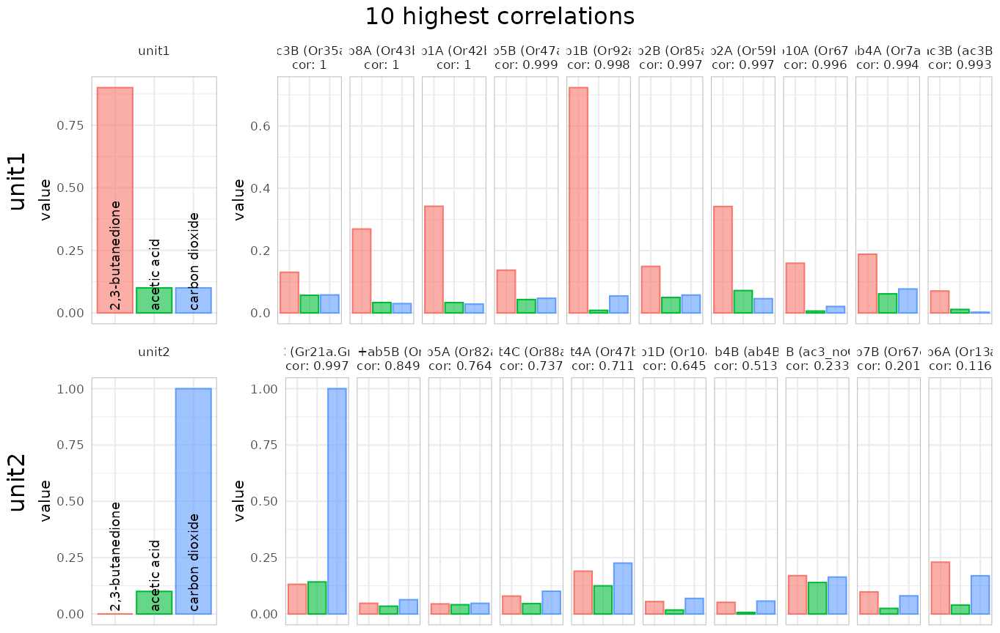
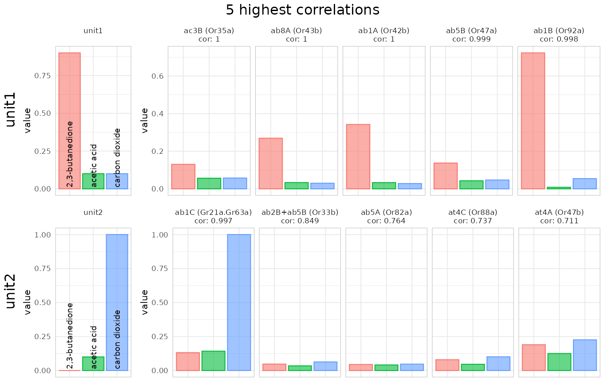
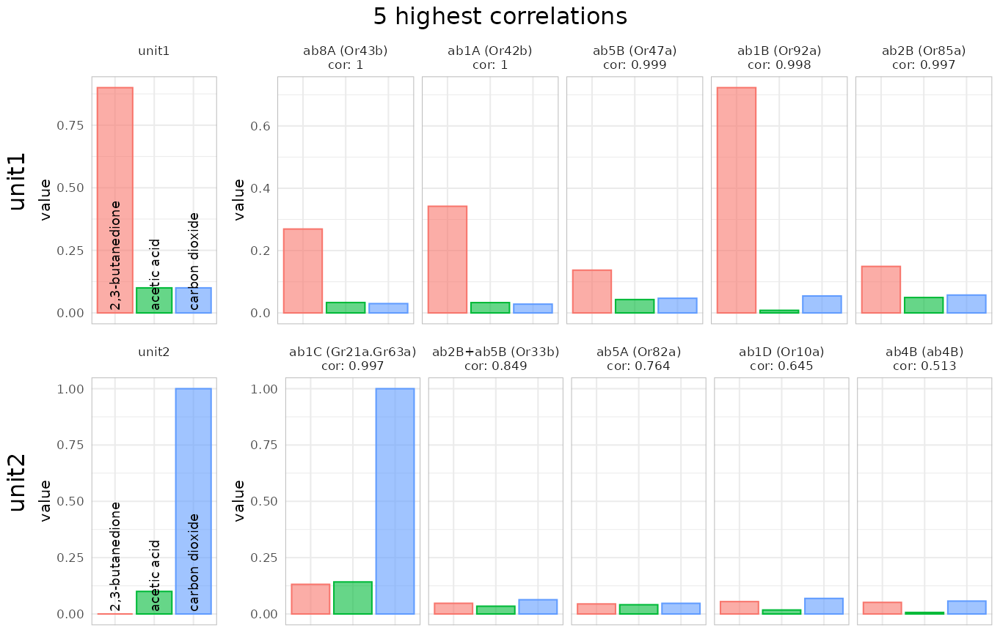
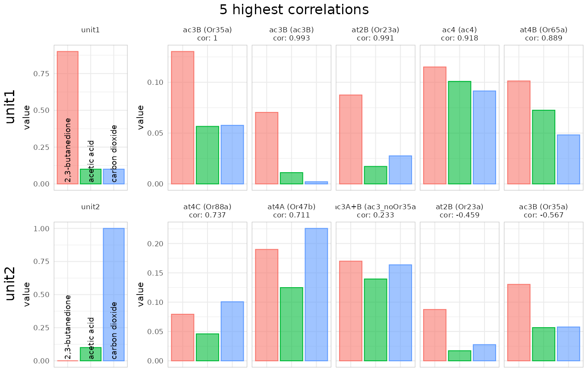
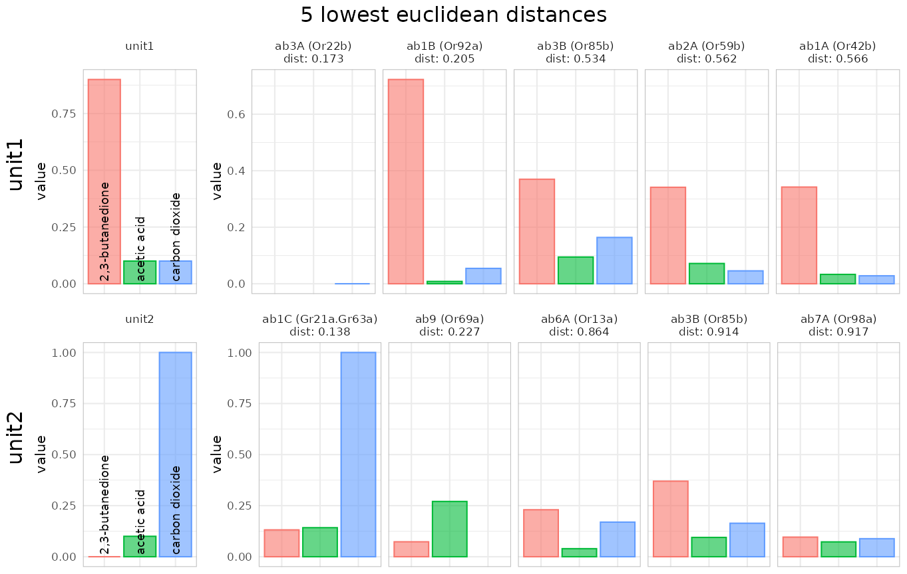
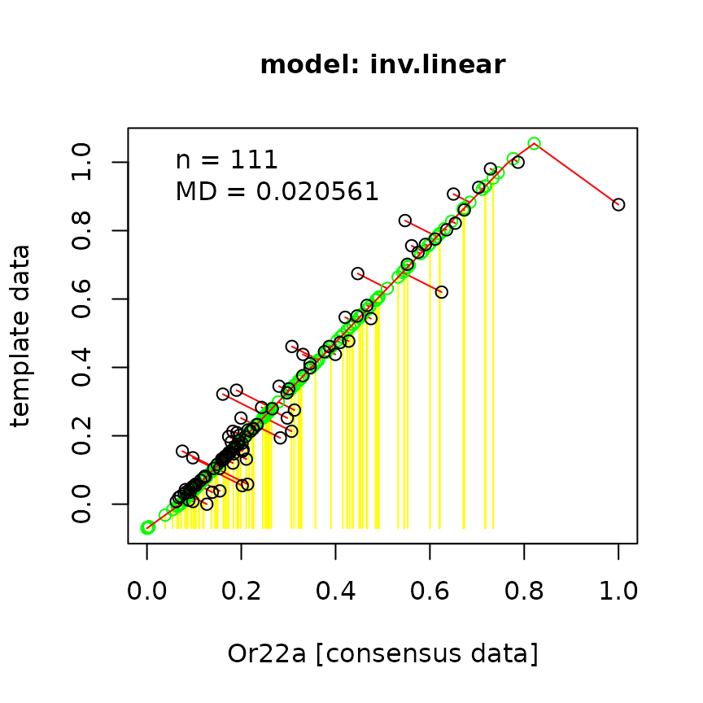

# DoOR analysis tools

The `DoOR.functions` package provides tools for the analysis of the data
provided by the `DoOR.data` package.

## Content

- [Loading data](#loading)
- [Identifying the sensillum we are recording from with
  `identify_sensillum()`](#identify_sensillum)
- [Finding neuron-specific odorants with
  `private_odorant()`](#private_odorant)
- [Mapping response data from an unknown source with
  `map_receptor()`](#map_receptor)
- [Changing the response unit with `back_project()`](#back_project)
- [Quantifying tuning curves with `sparse()`](#sparse)

## Loading data

First we need to load packages and data:

``` r

#load data
library(DoOR.functions)
```

    ## Loading required package: DoOR.data

    ## 
    ## Welcome to DoOR.data
    ## Version: 2.0.1.9001
    ## Released: 2026-07-17
    ## 
    ## Please use load_door_data() to load all data into your workspace 
    ##       now.

    ## 
    ## Welcome to DoOR.functions
    ## Version: 2.0.3.9000
    ## Released: 2026-07-10

``` r

library(DoOR.data)
load_door_data(nointeraction = TRUE)
```

## Identifying the sensillum we are recording from with `identify_sensillum()`

{#identify_sensillum} Imagine we perform an electrophysiological
recording from a *Drosophila* sensillum (single sensillum recording,
SSR) and we are not sure what sensillum we are recording from. In order
to identify the sensillum we used several diagnostic odorants (maybe
selected using [`private_odorant()`](#private_odorant)) and got
responses from the different sensory neurons the sensillum houses. We
can now pass our recorded data to
[`identify_sensillum()`](https://docs.ropensci.org/DoOR.functions/reference/identify_sensillum.md).

Let’s make up some simple fake data. We pretend to have recorded with
three odorants (2,3-butanedione, ethanoic acid and carbon dioxide) and
we could separate the responses of two units. Unit1 responded strongly
to 2,3-butanedione only, unit2 only responded to carbon dioxide. We
create a data.frame that contains a column called `odorants` with the
InChIKeys of our test odorants, and one column for each unit (name the
colnames as you like, e.g. unit1-n or Aneuro if you are sure about the
neuron).

``` r

recording <- data.frame(
  odorants = c(trans_id(c("BEDN", "ETAS"), "Code"),
               trans_id("carbon dioxide", "Name")),
  unit1 = c(.9,.1,.1),
  unit2 = c(0, .1, 1)
)
```

Next we feed the recording to the function:

### using correlations

``` r

identify_sensillum(recording, base_size = 8)
```

    ## found correlations above 0.9 for all 2 units in: ab1

 Note that the
function tells us that it found hits for all units in ab1 and ab5,
meaning that e.g. within the four neurons housed in the ab1 sensillum
both of our units had good matches. You can set this correlation
threshold with `min.cor`. If we increase the threshold to 0.99 only ab1
is returned as a double match:

``` r

identify_sensillum(recording, min.cor = .99)
```

    ## found correlations above 0.99 for all 2 units in: ab1

We can define the number of best hits that we want to get returned (the
default is 10):

``` r

identify_sensillum(recording, nshow = 5, base_size = 8)
```

    ## found correlations above 0.9 for all 2 units in: ab1

 And if we know
e.g. that we are recording from a basiconic sensillum we can restrict
the search to one or a few sensilla types:

``` r

identify_sensillum(recording, sub = "ab", nshow = 5, base_size = 8)
```

    ## found correlations above 0.9 for all 2 units in: ab1



``` r

identify_sensillum(recording, sub = c("ac","at"), nshow = 5, base_size = 8)
```



### using Euclidean distances

Instead of correlations we can also use the Euclidean distance as a
(dis)similarity measure:

``` r

identify_sensillum(recording, method = "dist", sub = "ab", nshow = 5, 
                   base_size = 8)
```

    ## Warning: Removed 2 rows containing missing values or values outside the scale range
    ## (`geom_bar()`).

    ## Warning: Removed 1 row containing missing values or values outside the scale range
    ## (`geom_bar()`).



### returning data instead of plots

We can also return the correlation/distance data instead of the plot
when setting `plot =FALSE`:

``` r

sensillumX <-
  identify_sensillum(recording,
  method = "dist",
  sub = "ab",
  plot = FALSE)
  head(sensillumX)
```

    ##       receptor sensillum  OSN     unit1     unit2
    ## Or7a      Or7a       ab4 ab4A 0.7131111 0.9430477
    ## Or9a      Or9a       ab8 ab8B 0.5688357 1.0031663
    ## Or10a    Or10a       ab1 ab1D 0.8497591 0.9363670
    ## Or13a    Or13a       ab6 ab6A 0.6763409 0.8639653
    ## Or22a    Or22a       ab3 ab3A 0.6596756 0.9979447
    ## Or22b    Or22b       ab3 ab3A 0.1732051 1.7320508

So apparently our fake recording came from the ab1 sensillum, which was
admittedly quite obvious as we had a strong carbon dioxide response and
ab1 houses the carbon dioxide receptor :)

## Finding neuron-specific odorants with `private_odorant()`

There may be several cases where we might be interested in so called
*private odorants*, odorants that specifically activate a given receptor
or sensory neuron. Maybe we are looking for diagnostic odorants for
sensillum identification or we want to activate a specific neuronal
pathway,
[`private_odorant()`](https://docs.ropensci.org/DoOR.functions/reference/private_odorant.md)
returns candidate odorants for that task.

Let’s say we want to specifically activate Or22a neurons:

``` r

private_odorant("Or22a")
```

    ##                                  Or22a   max.others  n difference
    ## GQKZRWSUJHVIPE-UHFFFAOYSA-N 0.43570150 -0.001626778  4  0.4373283
    ## SHZIWNPUGXLXDT-UHFFFAOYSA-N 0.78193674  0.417131636 29  0.3648051
    ## JGHZJRVDZXSNKQ-UHFFFAOYSA-N 0.52492990  0.243725635 28  0.2812043
    ## HCRBXQFHJMCTLF-UHFFFAOYSA-N 0.53683628  0.368857494 20  0.1679788
    ## SMQUZDBALVYZAC-UHFFFAOYSA-N 0.07433042 -0.075854326  1  0.1501847

We might want to return the odorant names instead of InChiKeys:

``` r

private_odorant("Or22a", tag = "Name")
```

    ##                              Or22a   max.others  n difference
    ## sec-amyl acetate        0.43570150 -0.001626778  4  0.4373283
    ## ethyl hexanoate         0.78193674  0.417131636 29  0.3648051
    ## methyl octanoate        0.52492990  0.243725635 28  0.2812043
    ## ethyl 2-methylbutanoate 0.53683628  0.368857494 20  0.1679788
    ## salicyl aldehyde        0.07433042 -0.075854326  1  0.1501847

So according to the function sec-amyl acetate would be a good candidate.
It activates Or22a at 0.4 (DoOR response, max is 1) while the maximum
activation in all other tested responding units (receptors, neurons,
glomeruli) is 0.016, a difference of 0.40. Sounds good, but it was
tested only in 4 other responding units, so I would rather go for ethyl
hexanoate with about the same difference but being tested in 29 other
responding units.

We can also restrict the search to the sensillum the responding units of
interest is related to:

``` r

private_odorant("Or22a", tag = "Name", sensillum = T)
```

    ## 
    ## >> Checking only against the ab3 sensillum (Or22a, Or22b, Or85b) <<

    ##                             Or22a max.others n difference
    ## ethyl hexanoate         0.7819367 0.23844314 1  0.5434936
    ## ethyl 2-methylbutanoate 0.5368363 0.03107633 1  0.5057599
    ## diethyl succinate       0.4659812 0.05652431 1  0.4094569
    ## methyl octanoate        0.5249299 0.14747177 1  0.3774581
    ## E2-hexenyl acetate      0.4271672 0.05042492 1  0.3767423

Ethyl 2-methylbutanoate sounds like a good hit, it has the same
difference to the other units as ethyl hexanoate but hardly elicits a
response at all from the other neuron. The n of 1 is fine as there are
only 2 neurons housed in the ab3 sensillum.

## Mapping response data from an unknown source with `map_receptor()`

{#map_receptor} Similar to
[`identify_sensillum()`](https://docs.ropensci.org/DoOR.functions/reference/identify_sensillum.md),
[`map_receptor()`](https://docs.ropensci.org/DoOR.functions/reference/map_receptor.md)
correlates a response vector to all responding units of the existing
DoOR consensus data. Let’s grab a data set from Or22a and see where it
ends up:

``` r

data <- data.frame(odorants  = Or22a$InChIKey, responses = Or22a$Hallem.2006.EN)
data <- na.omit(data)
head(data)
```

    ##                       odorants responses
    ## 1                          SFR         4
    ## 3  VHUUQVKOLVNVRT-UHFFFAOYSA-N        17
    ## 4  KIDHWZJUCRJVML-UHFFFAOYSA-N        16
    ## 5  VHRGRCVQAFMJIZ-UHFFFAOYSA-N        17
    ## 11 YEJRWHAVMIAJKC-UHFFFAOYSA-N        47
    ## 12 JBFHTYHTHYHCDJ-UHFFFAOYSA-N       144

``` r

map_receptor(data = data, nshow = 5)
```

    ## skipped Or22c, Or24a, Or67d, pb2A as overlap (n) was < 3

    ##       responding.unit   n       cor      p.value
    ## Or22a           Or22a 111 0.9658036 9.929338e-66
    ## Or47a           Or47a 111 0.7087026 3.270693e-18
    ## Or59c           Or59c  18 0.6657733 2.561096e-03
    ## Or43b           Or43b 111 0.6322969 9.835057e-14
    ## Or2a             Or2a 111 0.6157970 6.342287e-13

This example was a bit circular as the tested data contributed to the
consensus data…

## Changing the response unit (spikes, deltaF/F, …) with `back_project()`

{#back_project} The DoOR consensus data is normalized to values between
0 and 1. If we want to compare the DoOR data to one of our own
recordings, it would be great to have the DoOR data in the same unit as
our owne data (e.g. spikerate). This is what we can do with
[`back_project()`](https://docs.ropensci.org/DoOR.functions/reference/back_project.md),
we can rescale the DoOR data to fit a given response template.

As an example, let’s take the data Hallem et al. recorded from Or22a
*via* calcium imaging and rescale the DoOR responses accordingly. The
template has to have 2 columns named `odorants` and `responses`:

``` r

template <- data.frame(odorants  = Or22a$InChIKey,
                       responses = Or22a$Hallem.2006.EN)

bp <- back_project(template, responding.unit = "Or22a")
```

    ## Warning in getInitial.selfStart(func, data, mCall = as.list(match.call(func, :
    ## selfStart initializing functions should have a final '...' argument since R
    ## 4.1.0
    ## Warning in getInitial.selfStart(func, data, mCall = as.list(match.call(func, :
    ## selfStart initializing functions should have a final '...' argument since R
    ## 4.1.0



``` r

plot(bp$back_projected$original.data,
     bp$back_projected$back_projected.data,
     xlab = "DoOR consensus response",
     ylab = "back_projected data [spikes, Hallem.2006.EN]"
)
```


``` r

head(bp$back_projected)
```

    ##                      odorants back_projected.data original.data template.data
    ## 1                         SFR            6.620103    0.08448516             4
    ## 2 XLYOFNOQVPJJNP-UHFFFAOYSA-N          133.355630    0.36799124            NA
    ## 3 VHUUQVKOLVNVRT-UHFFFAOYSA-N           29.409493    0.18498406            17
    ## 4 KIDHWZJUCRJVML-UHFFFAOYSA-N           27.357834    0.17511431            16
    ## 5 VHRGRCVQAFMJIZ-UHFFFAOYSA-N           16.069298    0.08989517            17
    ## 6 QGZKDVFQNNGYKY-UHFFFAOYSA-N           13.558241    0.08805285            NA
    ##   fitted.data
    ## 1  0.06872184
    ## 2  0.51358830
    ## 3  0.14871705
    ## 4  0.14151533
    ## 5  0.10189036
    ## 6  0.09307606

All the yellow lines in the first plot represent odorant responses that
were not available in the original data set but were projected onto the
fitted function and rescaled to the units in “Hallem.2006.EN”. The
second plot shows the relationship between the rescaled data and the
original consensus responses.

## Quantifying tuning curves with `sparse()`

The width of a tuning curve, i.e. for example to how many odorants a
receptor shows strong responses, can be quantified using different
sparseness measures. We implemented kurtosis[^1] and sparseness[^2] in
[`sparse()`](https://docs.ropensci.org/DoOR.functions/reference/sparse.md).
A high kurtosis or sparseness value indicates a narrow tuning curve (see
also
[`dplot_tuningCurve()`](https://docs.ropensci.org/DoOR.functions/reference/dplot_tuningCurve.md)
in the [DoOR visualization
vignette](https://docs.ropensci.org/DoOR.functions/articles/DoOR_visualizations.html#tuningCurve)).
While kurtosis is able to deal with negative values, sparseness can’t
and thus all values need to be be transformed to absolute values first.
Sparseness scales between 0 and 1, kurtosis between -∞ and ∞, a kurtisis
of 0 corresponds to the Gaussian distribution.

``` r

rm.SFRreset <- reset_sfr(door_response_matrix, "SFR")

sparse(x = rm.SFRreset[,"Or69a"], method = "ltk")
```

    ## [1] -0.2615938

``` r

sparse(x = rm.SFRreset[,"Or69a"], method = "lts")
```

    ## [1] 0.1486392

``` r

sparse(x = rm.SFRreset[,"Gr21a.Gr63a"], method = "ltk")
```

    ## [1] 23.57197

``` r

sparse(x = abs(rm.SFRreset[,"Gr21a.Gr63a"]), method = "lts")
```

    ## [1] 0.7596749

[^1]: Willmore, B., Tolhurst, D.J., 2001. Characterizing the sparseness
    of neural codes. Network 12, 255–270.
    dx.doi.org/10.1080/net.12.3.255.270

[^2]: Bhandawat, V., Olsen, S.R., Gouwens, N.W., Schlief, M.L., Wilson,
    R.I., 2007. Sensory processing in the Drosophila antennal lobe
    increases reliability and separability of ensemble odor
    representations. Nature neuroscience 10, 1474–82.
    dx.doi.org/10.1038/nn1976
