# Visualizing DoOR

Apart from merging data and performing calculations on it, the
`DoOR.functions` package provides several ways to visualize the data
served by the `DoOR.data` package. Please see the [DoOR.function
vignette](https://docs.ropensci.org/DoOR.functions/articles/DoOR.functions.md)
for instructions on how to install and load both functions and data. The
plotting functions can be identified by their common prefix `dplot_`,
most of them make use of the `ggplot2` package which allows to override
most, if not all of the theming options.

## Content

- [Loading data](#loading)
- [Visualizing odorants *vs* responding units with
  `dplot_response_matrix()`](#responseMatrix)
- [Visualizing ensemble responses with `dplot_al_map()`](#ALmap)
- [Visualizing tuning curves with `dplot_tuningCurve()`](#tuningCurve)
- [Visualizing response profiles
  `dplot_response_profile()`](#responseProile)
- [Comparing response profiles
  `dplot_compare_profiles()`](#compareProfiles)
- [Visualizing odorant responses across responding units with
  `dplot_across_ru()`](#acrossReceptors)
- [Visualizing odorant responses across OSNs with
  `dplot_across_osns()`](#across_OSNs)

## Loading data

First we need to load packages and data:

``` r

#load data
library(DoOR.functions)
```

    ## Loading required package: DoOR.data

    ## 
    ## Welcome to DoOR.data
    ## Version: 2.0.1.9001
    ## Released: 2026-07-17
    ## 
    ## Please use load_door_data() to load all data into your workspace 
    ##       now.

    ## 
    ## Welcome to DoOR.functions
    ## Version: 2.0.3.9000
    ## Released: 2026-07-10

``` r

library(DoOR.data)
load_door_data(nointeraction = TRUE)
```

## Visualizing odorants *vs* responding units with `dplot_response_matrix()`

{#responseMatrix}
[`dplot_response_matrix()`](https://docs.ropensci.org/DoOR.functions/reference/dplot_response_matrix.md)
visualizes the DoOR consensus response matrix either as a point matrix
with the size of the points relating to the response strength, or as a
heatmap, relating color to response strength. The default plot that is
used depends on the data we enter: positive values only (like from
`door_response_matrix` or `door_response_matrix_non_normalized`) which
are scaled `[0,1]` will by default be plotted as a point-matrix. If we
provide data that contains negative values (e.g. data with the
spontaneous firing rate set to 0 via
`reset_sfr(door_response_matrix, "SFR")`) it will be shown as
color-coded heatmap.

``` r

dplot_response_matrix(door_response_matrix[2:50,], tag = "Name", base_size = 8)
```

    ## Only positive values, returning b&w point plot.

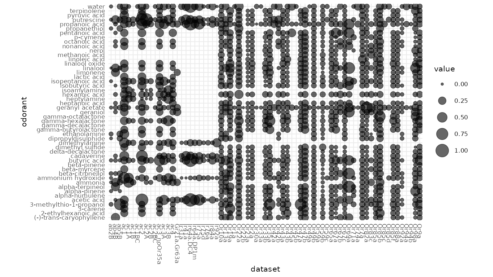

If the data contains negative values, a colored response matrix will be
plotted:

``` r

dplot_response_matrix(reset_sfr(door_response_matrix, "SFR")[2:50,], 
                      tag = "Name", base_size = 8)
```

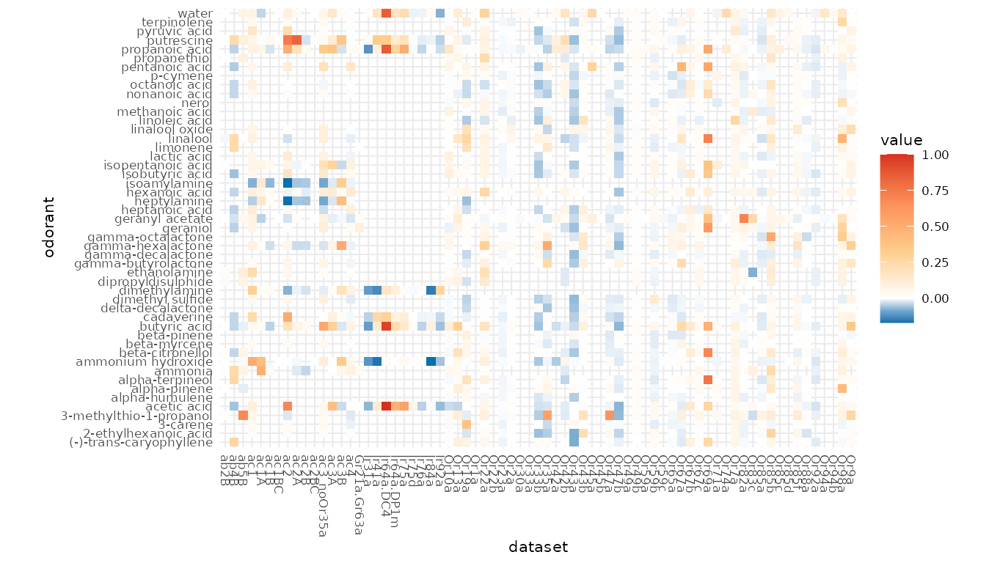

## Visualizing ensemble responses with `dplot_al_map()`

With
[`dplot_al_map()`](https://docs.ropensci.org/DoOR.functions/reference/dplot_al_map.md)
we can visualize the ensemble response a given odorant elicits across
DoOR responding units (receptors, sensory neurons, glomeruli, … ) as a
hypothetical antennal lobe activation pattern.

``` r

dplot_al_map("QSJXEFYPDANLFS-UHFFFAOYSA-N", base_size = 8)
```

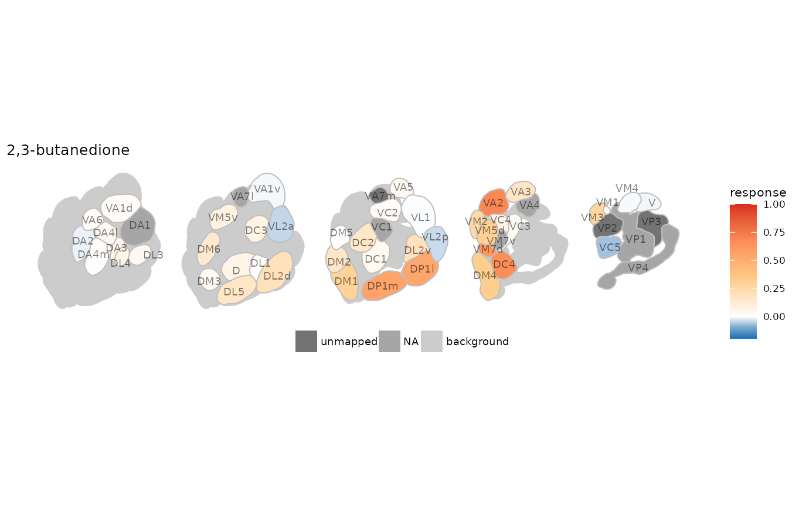 If we
do not know the InChIKey of the substance we are interested in, we can
use the
[`trans_id()`](https://docs.ropensci.org/DoOR.functions/reference/trans_id.md)
function for conversion. If we are interested in the expressed receptor
rather than the glomerulus names:

``` r

dplot_al_map(trans_id("benzaldehyde", from = "Name"), tag = "receptor", 
             main = "SMILES", base_size = 8)
```

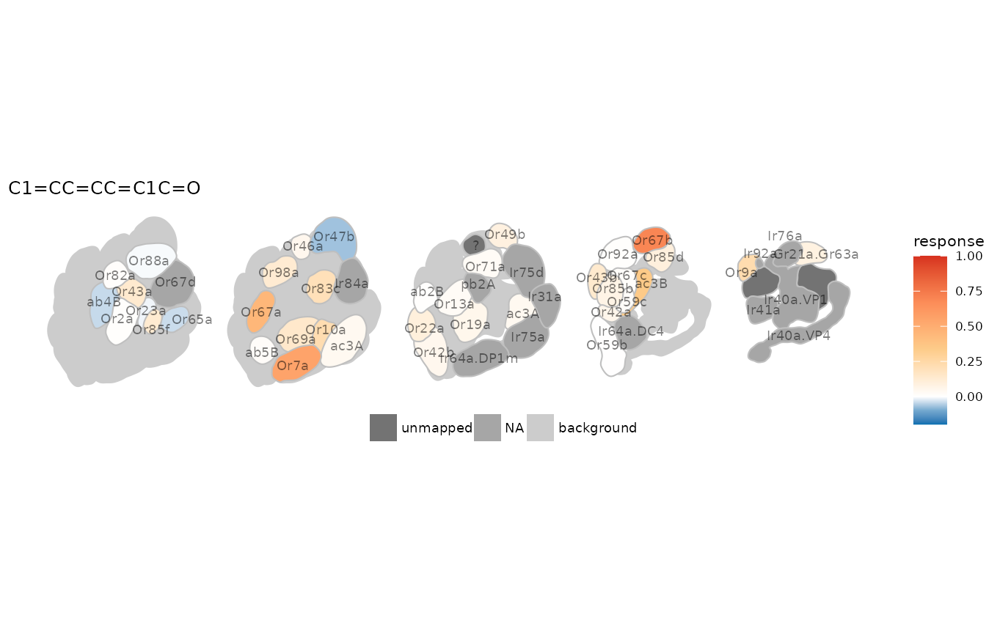

If we prefer the plain activation pattern without annotations at all:

``` r

dplot_al_map(trans_id("628-63-7", from = "CAS"), tag = "", main = "", 
             legend = FALSE, scalebar = FALSE)
```

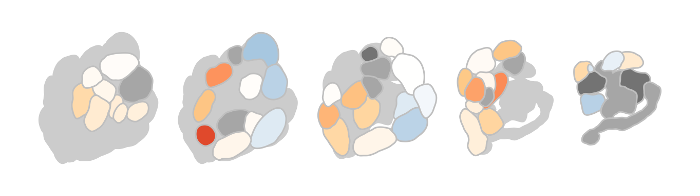

## Visualizing tuning curves with `dplot_tuningCurve()`

### Responding units

The set of odorants a given responding unit is responsive to can be
described as its tuning curve. With
[`dplot_tuningCurve()`](https://docs.ropensci.org/DoOR.functions/reference/dplot_tuningCurve.md)
we can easily display such a tuning curve together with its kurtosis.
Kurtosis is a measure of the shape of the tuning curve, i.e. whether a
responding unit is narrowly tuned to a few odorants (high kurtosis), or
whether it responds to many odorants (low kurtosis). The gaussian
distribution has a kurtosis of 0.

If we only specify the receptor/response unit name, the data is taken
from `door_response_matrix` and
[`dplot_tuningCurve()`](https://docs.ropensci.org/DoOR.functions/reference/dplot_tuningCurve.md)
uses
[`reset_sfr()`](https://docs.ropensci.org/DoOR.functions/reference/reset_sfr.md)
to reset spontaneous firing rate (or any other specified odorant) to
zero before plotting.

``` r

dplot_tuningCurve(receptor = "Or22a", base_size = 8)
```

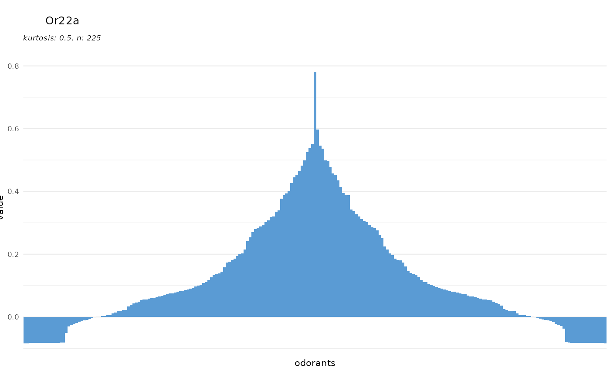

To prevent resetting by SFR:

``` r

dplot_tuningCurve(receptor = "Or22a", zero = "", base_size = 8)
```

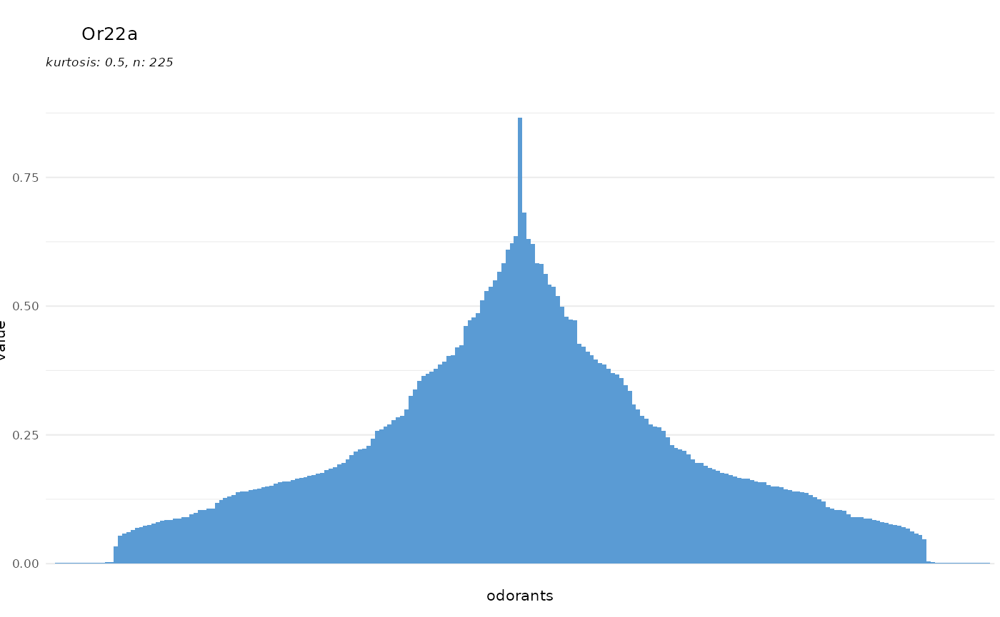

We can also plot any other vector of responses, once `response.vector`
is specified, the value of `receptor` is only used for the plot title
and not for data lookup anymore:

``` r

dplot_tuningCurve(receptor = "receptor X", response.vector = c(1:100), 
                  base_size = 8)
```

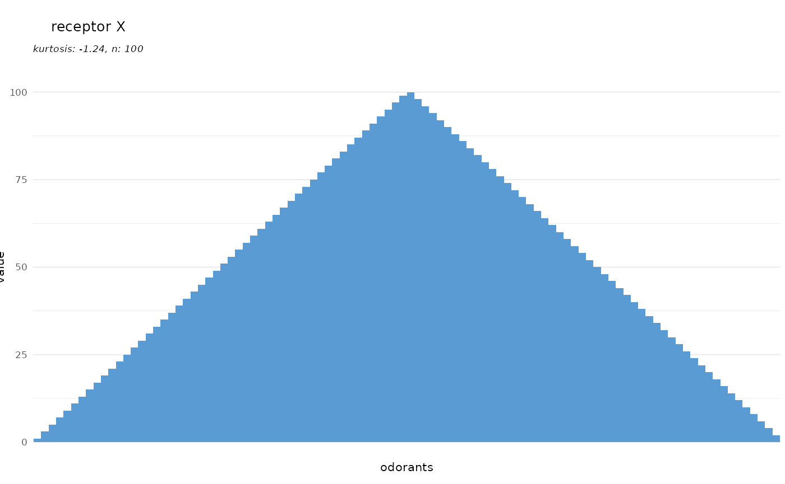

### Odorants

[`dplot_tuningCurve()`](https://docs.ropensci.org/DoOR.functions/reference/dplot_tuningCurve.md)
can as well be used to visualize the ensemble of responding units that
is activated by a given odorant. Therefore, we specify an odorant name
instead of a response unit name:

``` r

dplot_tuningCurve(odorant = "PGMYKACGEOXYJE-UHFFFAOYSA-N", base_size = 8)
```

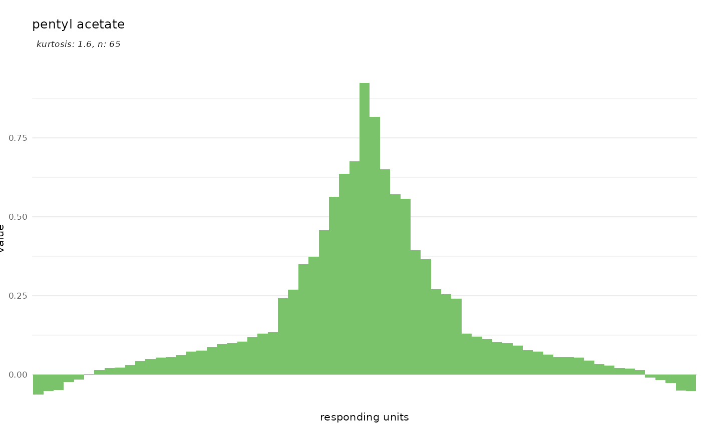

We can specify the chemical identifier to plot via `odor.main`:

``` r

dplot_tuningCurve(odorant = "PGMYKACGEOXYJE-UHFFFAOYSA-N", odor.main = "SMILES",
                  base_size = 8)
```

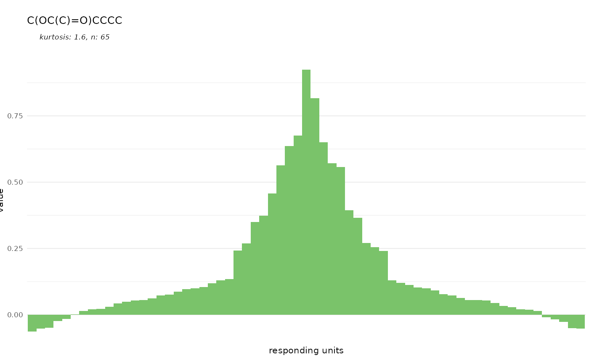

``` r

dplot_tuningCurve(odorant = "CURLTUGMZLYLDI-UHFFFAOYSA-N", odor.main = "InChI",
                  base_size = 8)
```

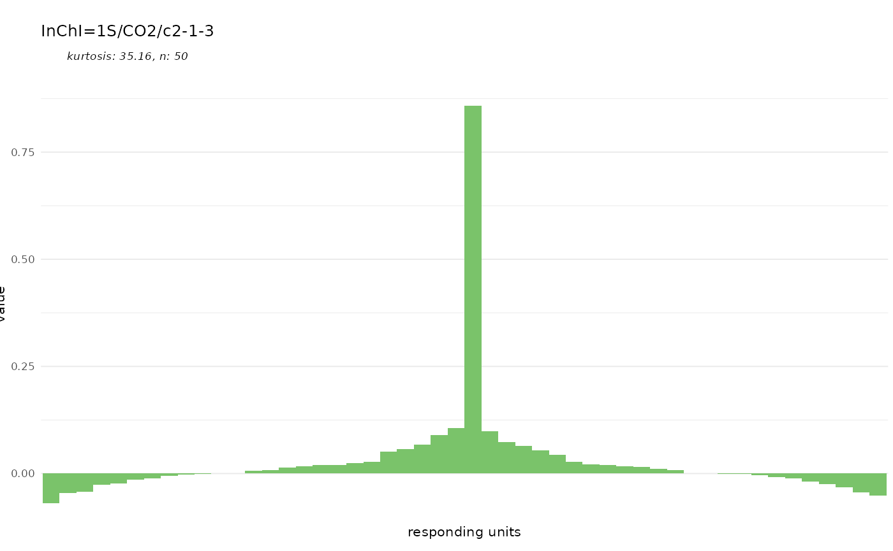

And finally we can control the color of the bars:

``` r

dplot_tuningCurve(odorant = trans_id("carbon dioxide", from = "Name"), 
                  fill.odorant = "#FF0000", base_size = 8)
```

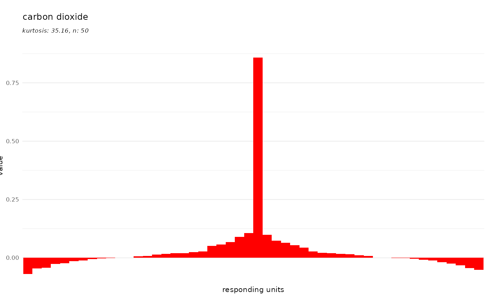

As mentioned, all of these plots are generated with the ggplot2 package
which allows to override theming:

``` r

library(ggplot2)
dplot_tuningCurve(odorant = trans_id("carbon dioxide", from = "Name"), 
                  base_size = 8) +
  theme(panel.background = element_rect(fill = "grey", color = "magenta"))
```

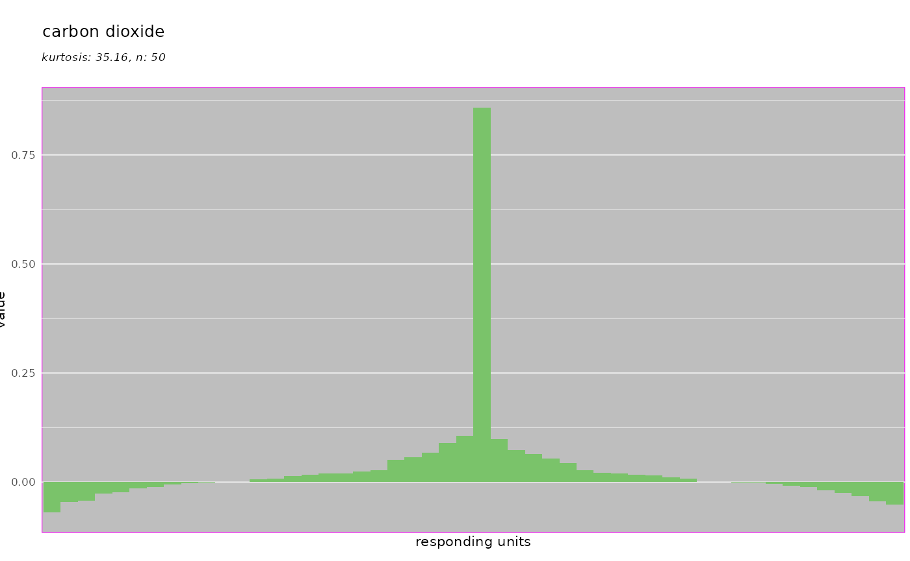

## Visualizing response profiles `dplot_response_profile()`

`dplot_response_profile` creates a horizontal bar plot of the response
profile of a given receptor. It displays the same data as
`dplot_tuningCurve` but focusses on the odorant identity.

Per default the response strength is displayed as bar height as well as
color code:

``` r

dplot_response_profile("Gr21a.Gr63a", tag = "Name", base_size = 8)
```

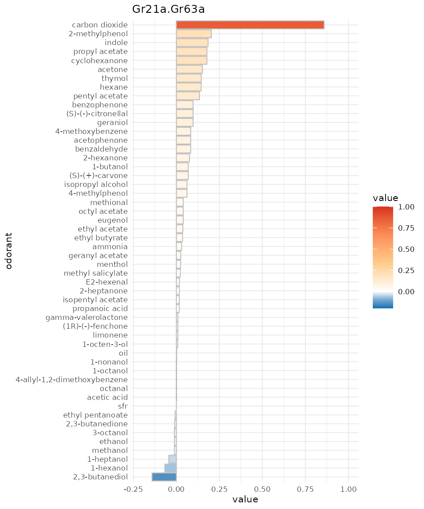

We can again omit to reset to SFR:

``` r

dplot_response_profile("Gr21a.Gr63a", tag = "Name", base_size = 8, zero ="")
```

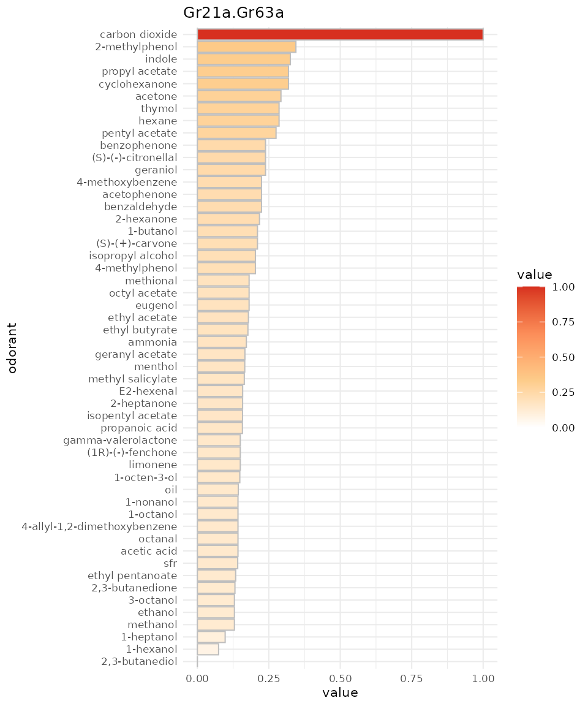

And if we prefer monochrome data:

``` r

dplot_response_profile("Gr21a.Gr63a", tag = "CAS", base_size = 8, 
                       colored = FALSE)
```

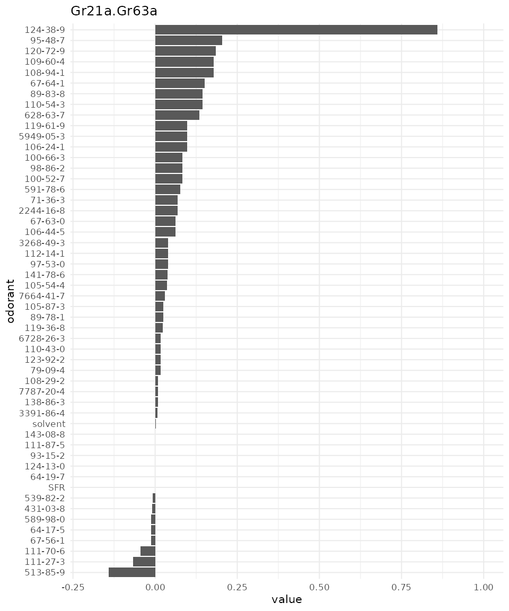

## Comparing response profiles `dplot_compare_profiles()`

As the name indicates, with
[`dplot_compare_profiles()`](https://docs.ropensci.org/DoOR.functions/reference/dplot_compare_profiles.md)
we can plot two response profiles side by side for comparison. The
syntax here differs from the previous plots as we can use it also to
compare the original data sets in DoOR.

### Comparing original data sets

This time, with `x` and `y` we have to specify a whole data.frame,
`by.x` and `by.y` take the corresponding column names that will be
plotted. If `x` is not specified, both `by.x` and `by.y` will be taken
from `x`.

``` r

dplot_compare_profiles(x = Or22a, y = Or22a, by.x = "Pelz.2006.AntEC50",
                         by.y = "Hallem.2004.EN", tag = "Name", base_size = 8)
```

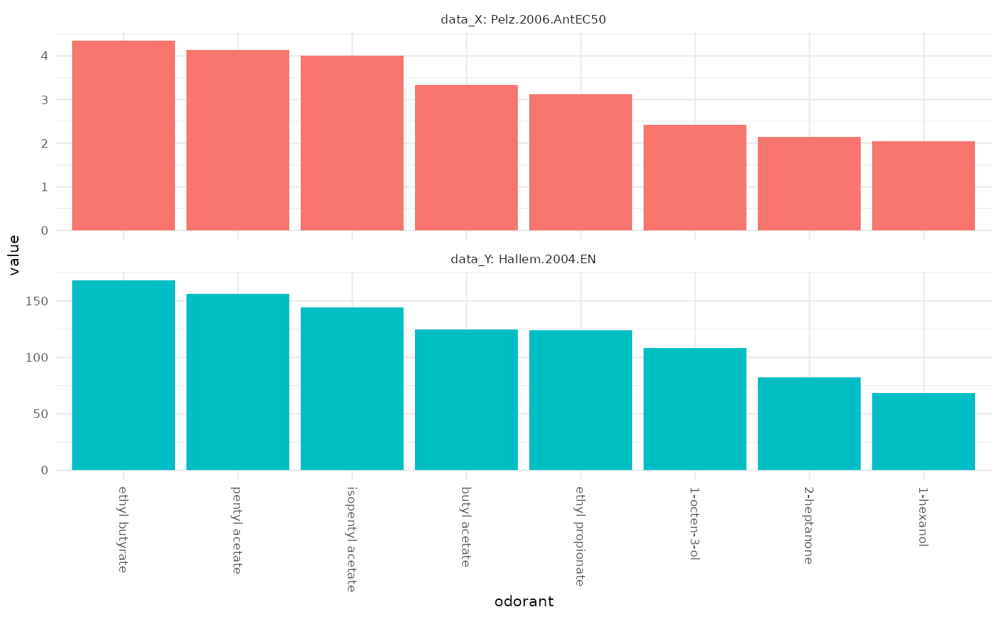

We see that the measured Or22a sensory neuron responses in these two
data sets are in good accordance.

### Comparing DoOR response profiles

Next we compare two DoOR consensus response profiles, measurements of
the misexpressed receptor Or35a and recordings from the ac3B sensory
neuron that naturally expresses Or35a:

``` r

dplot_compare_profiles(
  x = door_response_matrix,
  by.x = "Or35a",
  by.y = "ac3B",
  tag = "Name",
  base_size = 8
  )
```

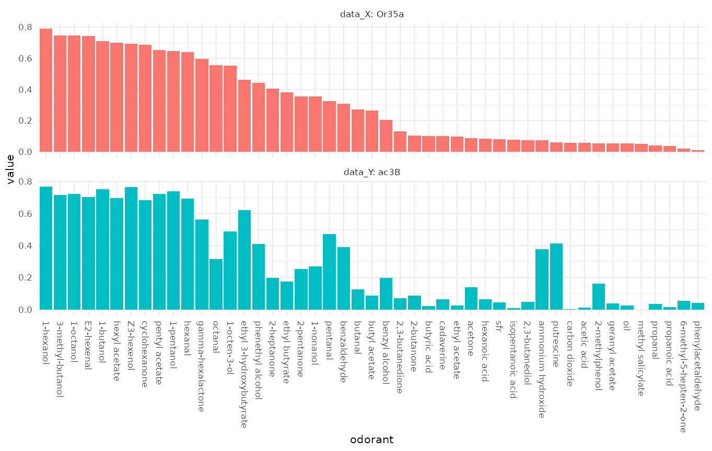

or with “SFR” set to 0:

``` r

dplot_compare_profiles(
  x = reset_sfr(door_response_matrix, "SFR"),
  by.x = "Or35a",
  by.y = "ac3B",
  tag = "Name",
  base_size = 8
  )
```

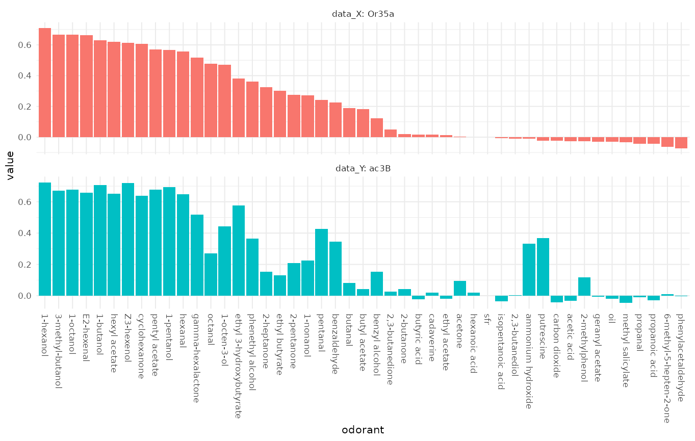

We see that the response profiles are very similar but not identical,
which is expected as the ac3B neuron expresses other receptors in
addition to Or35a.

## Visualizing responses across responding units with `dplot_across_ru()`

{#acrossReceptors} With
[`dplot_across_ru()`](https://docs.ropensci.org/DoOR.functions/reference/dplot_across_ru.md)
we can visualize the responses that one or several odorants elicit
across receptors / responding units.

``` r

odors <-
  trans_id(c("pentyl acetate", "carbon dioxide", "2,3-butanedione"), 
           from = "Name")
  dplot_across_ru(odors, tag = "Name", base_size = 8)
```

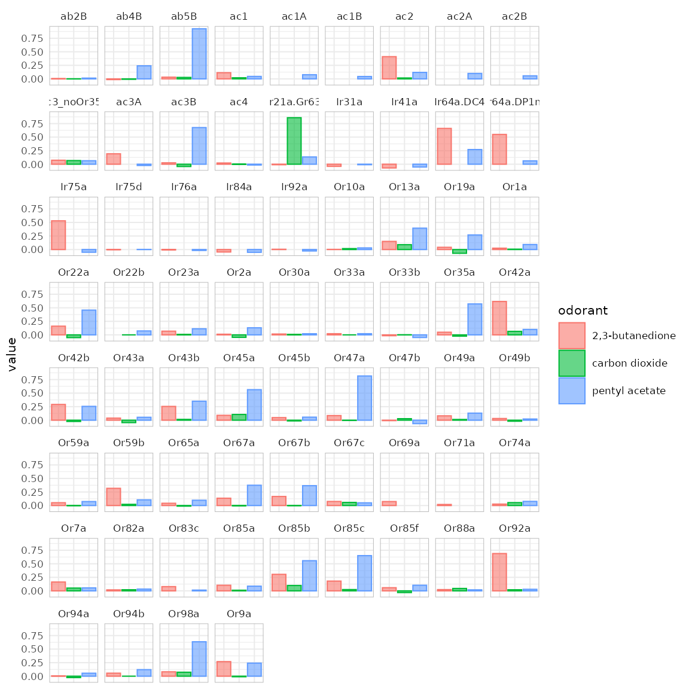

## Visualizing odorant responses across OSNs with `dplot_across_osns()`

{#across_OSNs}
[`dplot_across_osns()`](https://docs.ropensci.org/DoOR.functions/reference/dplot_across_osns.md)
is similar to
[`dplot_across_ru()`](https://docs.ropensci.org/DoOR.functions/reference/dplot_across_ru.md)
but the responding units are sorted according to the sensory neuron they
belong to. This sorting is controlled via `door_mappings` from the
`DoOR.data` package. There are two types of plot that
[`dplot_across_osns()`](https://docs.ropensci.org/DoOR.functions/reference/dplot_across_osns.md)
can return. Type 2 directly resembles
[`dplot_across_ru()`](https://docs.ropensci.org/DoOR.functions/reference/dplot_across_ru.md):

``` r

dplot_across_osns(odors, base_size = 8, plot.type = 2)
```

    ## Warning: Removed 37 rows containing missing values or values outside the scale range
    ## (`geom_bar()`).

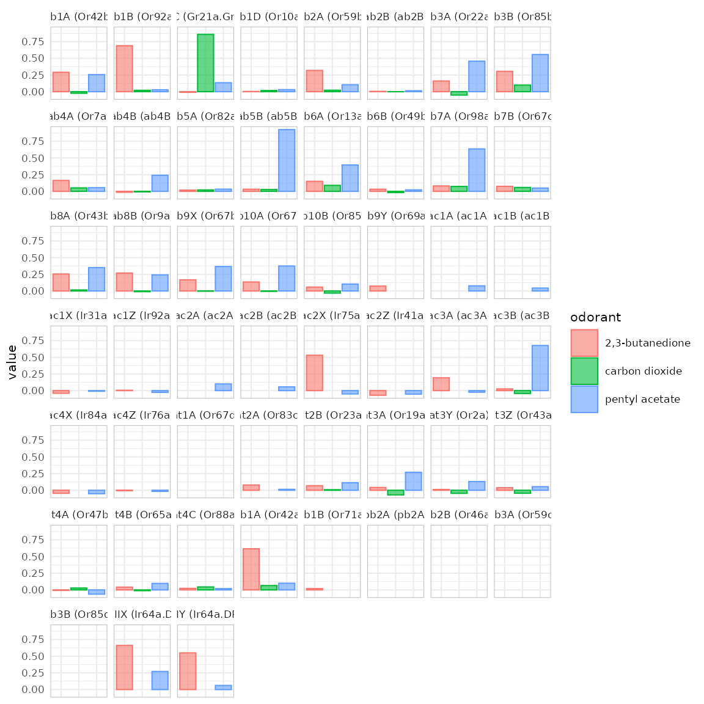

In type 1 the data is split according to odorant X sensillum, the color
is assigned to the corresponding neuron A-D or X-Z if the neuron’s
identity is unknown:

``` r

dplot_across_osns(odors, base_size = 8, plot.type = 1)
```

    ## Warning: Removed 37 rows containing missing values or values outside the scale range
    ## (`geom_bar()`).

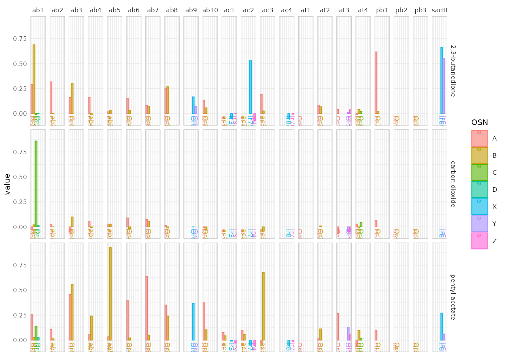

As this plot gets pretty messy, we have the option to restrict plotting
to certain subsets of sensilla. We can for example only plot the
responses of antennal basiconic (ab) sensilla:

``` r

dplot_across_osns(odors, base_size = 8, plot.type = 1, sub = "ab")
```

    ## Warning: Removed 2 rows containing missing values or values outside the scale range
    ## (`geom_bar()`).

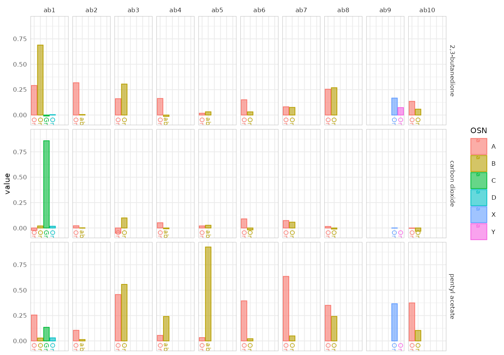

Or we plot coeloconic and trichoid sensilla:

``` r

dplot_across_osns(odors, base_size = 8, plot.type = 1, sub = c("ac", "at"))
```

    ## Warning: Removed 19 rows containing missing values or values outside the scale range
    ## (`geom_bar()`).

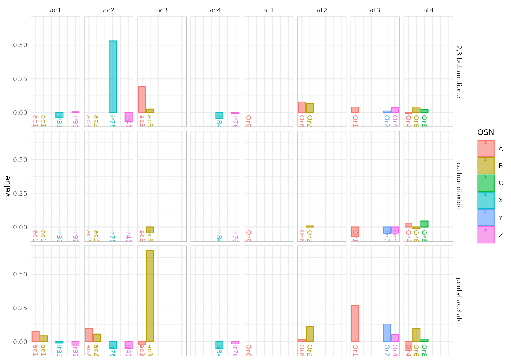
